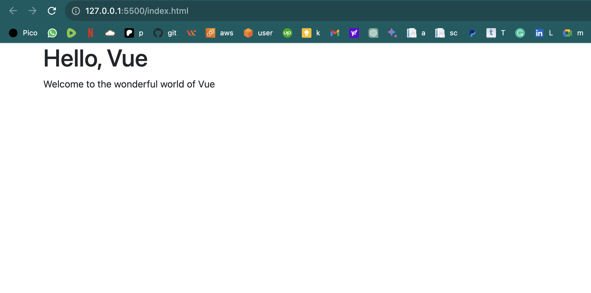

# BASIC VUE APPLICATION


1. Create an `index.html` file by running:

```
code index.html
```

2. Paste the code below in it

```
<!DOCTYPE html>
<html lang="en">
<head>
    <meta charset="UTF-8">
    <meta name="viewport" content="width=device-width, initial-scale=1.0">
    <title>Vue Basics</title>
    <link rel="stylesheet" href="https://cdn.jsdelivr.net/npm/bootstrap@5.0.2/dist/css/bootstrap.min.css">
    <script src="https://unpkg.com/vue@3.3.9/dist/vue.global.js"></script>
</head>
<body>
    <div id="content" class="container"> 
        <h1>{{ pageTitle }}</h1>
        <p>{{ content }}</p> 
    </div>
    <script>
        Vue.createApp({
            data() {
                return {
                    pageTitle: 'Hello, Vue',
                    content: 'Welcome to the wonderful world of Vue'
                };
            }
        }).mount('#content');
    </script>
</body>
</html>
```

3. Visit `http://127.0.0.1:5500/index.html` on your browser. Your should see the page below:




4. Code explanation for index.html:

* "<!DOCTYPE html">": Defines the document type and version of HTML being used.

* "<html lang="en"">": Specifies that the document is in English.

* "<head">": Contains metadata and links to external resources.

* "<meta charset="UTF-8"">": Defines the character encoding for the document as UTF-8.

* "<meta name="viewport" content="width=device-width, initial-scale=1.0"">": Sets the viewport properties for responsive design.

* "<title>Vue Basics</title>": Sets the title of the webpage.

* <link rel="stylesheet" href="https://cdn.jsdelivr.net/npm/bootstrap@5.0.2/dist/css/bootstrap.min.css">: Links to the Bootstrap CSS framework.

* <script src="https://unpkg.com/vue@3.3.9/dist/vue.global.js"></script>: Includes the Vue.js library from a CDN (Content Delivery Network).

* <body>: Contains the content of the webpage.

* <div id="content" class="container">: Defines a container div element with the id "content."

* <h1>{{ pageTitle }}</h1>: Displays the value of the pageTitle property using Vue.js template syntax.

* <p>{{ content }}</p>: Displays the value of the content property using Vue.js template syntax.

* <script>: Contains the JavaScript code for the Vue.js application.

* Vue.createApp({ ... }): Creates a Vue application instance.

* data() { ... }: Defines the data properties for the Vue application, including pageTitle and content.

* .mount('#content'): Mounts the Vue application to the "content" div element, making it control the content within that element.


# vue-js-basics
